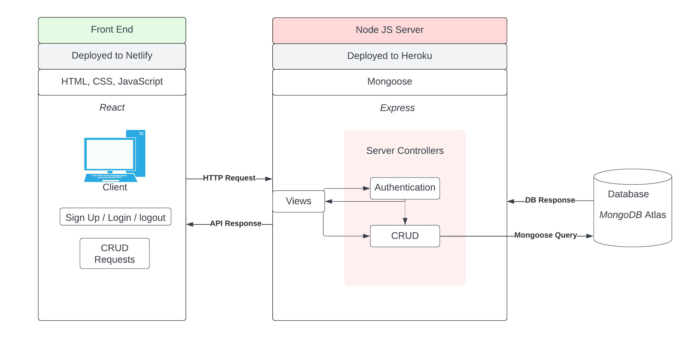

# T3A2-B Star Explorer's Companion App

- Deployed Client: [https://star-companion.netlify.app/](https://star-companion.netlify.app/)
- Deployed Server: [https://star-companion-app-backend.onrender.com](https://star-companion-app-backend.onrender.com)
- Github Repo: [https://github.com/SheaDuffy13/T3A2-B_Star-Companion-App](https://github.com/SheaDuffy13/T3A2-B_Star-Companion-App)

### Purpose

Inspired by the upcoming Starfield game, this website serves as a companion app for space explorers. As adventurers travel through various star systems, they can use the website to keep a record of their discoveries and experiences. Users can add and name planets, upload images, and take notes for each planet they visit. The website provides a platform for users to easily access an overview of their past explorations and track down specific locations or creatures they wish to revisit.

### Functionality / features

- Key Features:
  - Sign up and log in.
  - Add/Edit/Delete planets/moons to the star systems.
  - Add/Edit/Delete images & notes to specific planets.
  - View images and notes for each planet.
  - Switch view between star systems.
  - Search function.

- Nice to Have:
  - A gallery of all images, with image details linking to their planet.
  - Images can be tagged and sorted by tag.
  - A cool visual layout.

### Target audience:

The target audience for this website would be fans of the upcoming Starfield game, space explorers, and anyone interested in keeping a record of their discoveries and experiences during interplanetary travel.

### Tech stack

#### **Front-end**

- HTML
- JavaScript
- CSS
- React

#### **Back-end**

- Express
- Node.js

#### **Database**

- MongoDB
- Mongoose

#### **Deployment**

- Render
- Netlify

#### **Project Management Tools**

- Trello

#### **Testing**

- Jest

#### **DevOps Tools**

- git
- GitHub
- Visual Studio Code

#### Design Tools

- Figma
- Balsamiq
- Lucidchart

## Libraries

#### Backend
- **bcryptjs:** Enables storing passwords as hashed passwords instead of plaintext.
- **cloudinary:** A cloud service that offers a solution to a web application’s entire image management pipeline.
- **cors:** Cross-origin resource sharing (CORS) is a browser mechanism which enables controlled access to resources located outside of a given domain.
- **dotenv:** A zero-dependency module that loads environment variables from a .env file into process.env.
- **express:** A minimal and flexible Node.js web application framework that provides a robust set of features for web and mobile applications
- **helmet:** Helps you secure your Express apps by setting various HTTP headers. It’s not a silver bullet, but it can help.
- **jsonwebtoken:** An open standard (RFC 7519) that defines a compact and self-contained way for securely transmitting information between parties as a JSON object.
- **mongoose:** An Object Data Modeling (ODM) library for MongoDB and Node.js. It manages relationships between data, provides schema validation, and is used to translate between objects in code and the representation of those objects in MongoDB.
- **supertest:** For testing Node.js HTTP servers, providing a high-level abstraction for testing HTTP while still allowing developers to use the lower-level API provided by SuperAgent

#### Frontend
- **axios:** A popular, promise-based HTTP client that sports an easy-to-use API and can be used in both the browser and Node.js.
- **cloudinary-react:** Cloudinary’s React library provides plugins to render the media on your site in the most optimal way and improve your user’s experience by automating media tasks like lazy loading, responsive images, and more.
- **jwt-decode:** A small browser library that helps decoding JWTs token which are Base64Url encoded.
- **react**: A JavaScript library for building user interfaces.
- **react-dom:** Enables you to implement dynamic routing in a web app
- **react-router-dom:** This package serves as the entry point to the DOM and server renderers for React. It is intended to be paired with the generic React package, which is shipped as react to npm.
- **react-scripts:**  This package includes scripts and configuration used by Create React App.
- **web-vitals:** Standardized metrics that quantify the user experience of a website based on a set of factors Google considers important
- **@testing-library/jest-dom:** A companion library for Testing Library that provides more advanced simulation of browser interactions than the built-in fireEvent method.
- **@testing-library/react:** React Testing Library builds on top of DOM Testing Library by adding APIs for working with React components.
- **@testing-library/user-event:** A companion library for Testing Library that provides more advanced simulation of browser interactions than the built-in fireEvent method.

## R2 Dataflow Diagram

## R3 Application Architecture Diagram

## R4 User Stories

- As a space explorer I want to I want to be able to add and name planets and moons to different star systems so that I can keep track of my discoveries and organize my exploration.

- As a space explorer I want to be able to upload images and notes for each planet so that I can document my findings.

- As a space explorer I want to be able to view my records of images and notes for each planet so that I can review my discoveries and plan.future exploration.

- As a space explorer and enthusiast of alien flora, fauna and landscapes, I want to be able to give tags to images and sort them by tag so that I can organize my images and find them more easily.

- As a space explorer I want to be able to search for planets or star systems so that I can quickly find a specific locations.

- As a space explorer, I want to have the ability to view a gallery of all images, each with a link to its origin. This will allow me to easily track down specific discoveries and revisit them.

### Updated User Story

In the revised user story, the need has been updated to include the ability to view a collection of all notes, in addition to the gallery of all images. This expands the functionality of the app and allows users to easily track down specific notes and observations.

**Original user story:**
As a space explorer, I want to have the ability to view a gallery of all images, each with a link to its origin. This will allow me to easily track down specific discoveries and revisit them.

**Revised user story:**
As a space explorer, I want to have the ability to view a gallery of all images as well as a collection of all notes, each with a link to its origin. This will allow me to easily track down specific discoveries or observations and revisit them.

## R5 Wireframes

Home / galaxy view page

Star sytem page

Planet page

Image gallery

Log in or sign up

Profile page

## R6 Trello board Part-A

Trello board can be found here: https://trello.com/b/AGrGgOfh/t3a2-a-documentation

I chose to use Trello as my project management tool as it allows me to organize and prioritize tasks using boards, lists, and cards. I created a board for my project and added lists to represent different stages of the development process. Within each list, I added cards to represent individual tasks, and added details such as descriptions, checklists and due dates to each card. I regularly updated the board to reflect the current state of the project, moving cards between the todo, doing and completed lists.

## Trello board Part-B

Trello board can be found here: https://trello.com/b/1LPFQJ00/t3a2-b

## User testing

#### Production Site:

User Testing Report for Space Explorer Companion App

Participants: 3 space exploration enthusiasts, aged 25-40

Test Plan:

Participants were asked to complete the following tasks using the Space Explorer Companion App:
- Make an account and log in
- Add a new planet to a star system and name it
- Upload an image and modify the note for the planet
- View the records of images and notes for the planet

Results:

All participants were able to successfully complete tasks 1-4 without any issues.

Feedback:

Overall, participants found the application easy to use and fairly intuitive.
Participants appreciated the ability to organize their discoveries by adding planets to different star systems.
Participants found the ability to upload images and notes for each planet very useful for documenting their findings.
Some participants suggested making the option to to view a gallery of all images, a feature that was dropped due to time. Some would prefer a cleaner ui for uploading images.

Conclusion:

The user testing session provided valuable feedback on the usability of the Space Explorer Companion App.
The results suggest that users are able to successfully use the app to create planets, upload images and notes, and view their records.
Some improvements could be made with a better UX and more features.

#### Development Site:

User Testing Report for Space Explorer Companion App (Development Site)

Test Plan:

Complete the following tasks using the development site of the Space Explorer Companion App:
- Sign up for a new account and log in
- Add a new planet to the star system and delete it
- Upload an image and a note for the planet
- View the records of images and notes for the planet
- View profile page and delete profile

Results:

- The sign-up and login process was straightforward and easy to use. However when the token expired, the profile page was still set to the user's details.
- Accessing the star page without being logged in throws errors and isn't gracefully handled
- Able to successfully create planets, upload images and notes, and view their records. Deleting planets does not yet cascade delete images.
- Participants were able to successfully view their profile page and delete their profile.
Feedback:

Conclusion:

The user testing session provided valuable feedback on the usability of the development site of the Space Explorer Companion App.
The results suggest that users are able to successfully use the app to sign up, log in, create planets, upload images and notes, view their records, view their profile page, and delete their profile.
Some improvements could be made with more thorough functions and error handling.